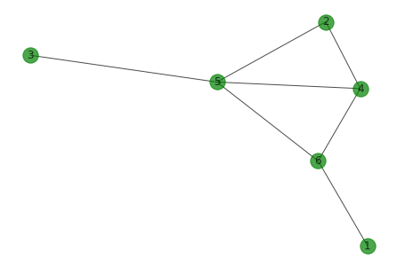
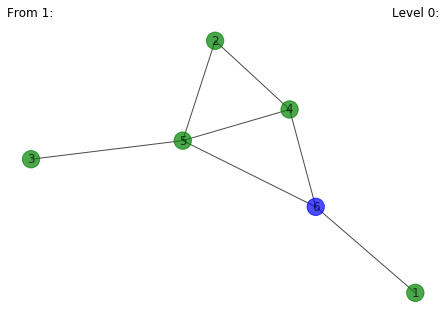
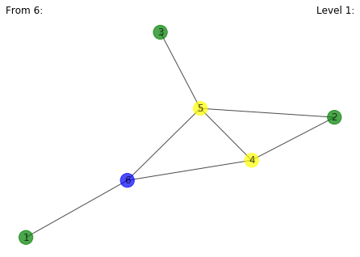
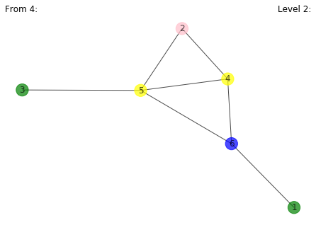
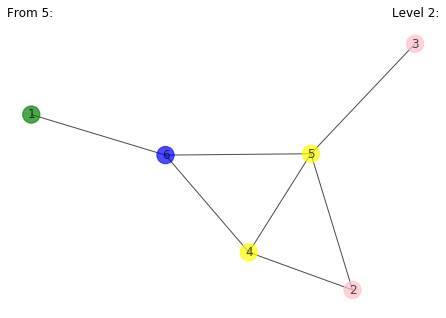
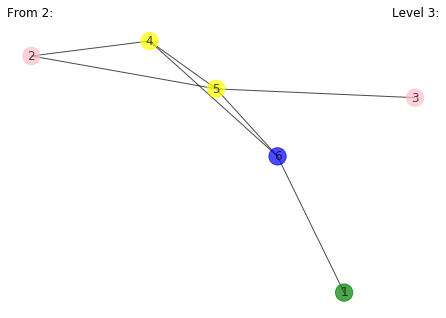
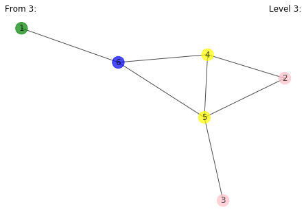

```python
import networkx as nx
import matplotlib.pyplot as plt
from collections import deque
import random
```


```python
def CreateGraph(node, edge):
    G = nx.Graph()
    for i in range(1, node+1):
        G.add_node(i)
    for i in range(edge):
        u, v = random.randint(1, node), random.randint(1, node)
        G.add_edge(u, v) 
    return G
```


```python
def DrawGraph(G, color):
    pos = nx.spring_layout(G)
    nx.draw(G, pos, with_labels = True, node_color = color, edge_color = 'black' ,width = 1, alpha = 0.7)  #with_labels=true is to show the node number in the output graph
```


```python
def DrawIteratedGraph(G,col_val):
    pos = nx.spring_layout(G)
    color = ["green", "blue", "yellow", "pink", "red", "black", "gray", "brown", "orange", "plum"]
    values = []
    for node in G.nodes():
        values.append(color[col_val[node]])
    nx.draw(G, pos, with_labels = True, node_color = values, edge_color = 'black' ,width = 1, alpha = 0.7)  #with_labels=true is to show the node number in the output graph
```


```python
def DrawSolutionGraph(G,col_val):
    pos = nx.spring_layout(G)
    values = []
    for node in G.nodes():
        values.append(col_val.get(node, col_val.get(node)))
    nx.draw(G, pos, with_labels = True, node_color = values, edge_color = 'black' ,width = 1, alpha = 0.7)  #with_labels=true is to show the node number in the output graph
```


```python

def BFS(start):
    queue = deque()  
    queue.append(start)
    visited[start] = True
    level[start] = 0
    
    while queue:
        u = queue.popleft()
        print(u, " -> ", end = "")
        for v in G.adj[u]:
            if not visited[v]:
                queue.append(v)
                visited[v] = True
                level[v] = level[u] + 1
                
        DrawIteratedGraph(G, level)
        plt.title('From {}:'.format(u), loc='left')
        plt.title('Level {}:'.format(level[u]), loc='right')
        plt.show()
        
    print("End")
```


```python
if __name__ == "__main__":
    
    node, edge = 6, 10
    
    G = CreateGraph(node, edge)
    print("Nodes: ", G.nodes)
    DrawGraph(G, "green")
    plt.show()
    visited = [False for i in range(node+1)]
    level = [0 for i in range(node+1)]
    parent = [0 for i in range(node+1)]
    root = 1
    BFS(root)
```

    Nodes:  [1, 2, 3, 4, 5, 6]





    1  -> 





    6  -> 





    4  -> 





    5  -> 





    2  -> 





    3  -> 





    End


```python

```
