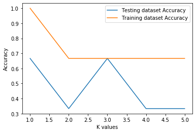

# Kth Nearest Neighbors


```python
import pandas as pd  # dataframe
import matplotlib.pyplot as plt #represtation
```


```python
dataset = pd.read_csv("Income.csv")
dataset.head()
```


<div>
<style scoped>
    .dataframe tbody tr th:only-of-type {
        vertical-align: middle;
    }

    .dataframe tbody tr th {
        vertical-align: top;
    }

    .dataframe thead th {
        text-align: right;
    }
</style>
<table border="1" class="dataframe">
  <thead>
    <tr style="text-align: right;">
      <th></th>
      <th>Age</th>
      <th>Income</th>
      <th>Student</th>
      <th>Credit</th>
      <th>effect</th>
    </tr>
  </thead>
  <tbody>
    <tr>
      <th>0</th>
      <td>&lt;30</td>
      <td>high</td>
      <td>no</td>
      <td>fair</td>
      <td>negative</td>
    </tr>
    <tr>
      <th>1</th>
      <td>&lt;=30</td>
      <td>high</td>
      <td>no</td>
      <td>excellent</td>
      <td>negative</td>
    </tr>
    <tr>
      <th>2</th>
      <td>31-40</td>
      <td>high</td>
      <td>no</td>
      <td>fair</td>
      <td>positive</td>
    </tr>
    <tr>
      <th>3</th>
      <td>&gt;40</td>
      <td>medium</td>
      <td>no</td>
      <td>fair</td>
      <td>positive</td>
    </tr>
    <tr>
      <th>4</th>
      <td>&lt;=30</td>
      <td>high</td>
      <td>no</td>
      <td>fair</td>
      <td>negative</td>
    </tr>
  </tbody>
</table>
</div>


```python
dataset.info()
```

    <class 'pandas.core.frame.DataFrame'>
    RangeIndex: 9 entries, 0 to 8
    Data columns (total 5 columns):
     #   Column   Non-Null Count  Dtype 
    ---  ------   --------------  ----- 
     0   Age      9 non-null      object
     1   Income   9 non-null      object
     2   Student  9 non-null      object
     3   Credit   9 non-null      object
     4   effect   9 non-null      object
    dtypes: object(5)
    memory usage: 488.0+ bytes


```python
X = dataset.drop(['effect'], axis = 'columns')
Y = dataset['effect']
```

# Labeling Data


```python
from sklearn.preprocessing import LabelEncoder #Labeling string with number
```


```python
new_age = LabelEncoder()
new_Income = LabelEncoder()
new_Student = LabelEncoder()
new_Credit = LabelEncoder()
new_d = LabelEncoder()
```


```python
X['age_n'] = new_age.fit_transform(X['Age'])
X['Income_n'] = new_Income.fit_transform(X['Income'])
X['Student_n'] = new_Student.fit_transform(X['Student'])
X['Credit_n'] = new_Credit.fit_transform(X['Credit'])
Y = new_d.fit_transform(Y)
X.head()
```


<div>
<style scoped>
    .dataframe tbody tr th:only-of-type {
        vertical-align: middle;
    }

    .dataframe tbody tr th {
        vertical-align: top;
    }

    .dataframe thead th {
        text-align: right;
    }
</style>
<table border="1" class="dataframe">
  <thead>
    <tr style="text-align: right;">
      <th></th>
      <th>Age</th>
      <th>Income</th>
      <th>Student</th>
      <th>Credit</th>
      <th>age_n</th>
      <th>Income_n</th>
      <th>Student_n</th>
      <th>Credit_n</th>
    </tr>
  </thead>
  <tbody>
    <tr>
      <th>0</th>
      <td>&lt;30</td>
      <td>high</td>
      <td>no</td>
      <td>fair</td>
      <td>1</td>
      <td>0</td>
      <td>0</td>
      <td>1</td>
    </tr>
    <tr>
      <th>1</th>
      <td>&lt;=30</td>
      <td>high</td>
      <td>no</td>
      <td>excellent</td>
      <td>2</td>
      <td>0</td>
      <td>0</td>
      <td>0</td>
    </tr>
    <tr>
      <th>2</th>
      <td>31-40</td>
      <td>high</td>
      <td>no</td>
      <td>fair</td>
      <td>0</td>
      <td>0</td>
      <td>0</td>
      <td>1</td>
    </tr>
    <tr>
      <th>3</th>
      <td>&gt;40</td>
      <td>medium</td>
      <td>no</td>
      <td>fair</td>
      <td>3</td>
      <td>2</td>
      <td>0</td>
      <td>1</td>
    </tr>
    <tr>
      <th>4</th>
      <td>&lt;=30</td>
      <td>high</td>
      <td>no</td>
      <td>fair</td>
      <td>2</td>
      <td>0</td>
      <td>0</td>
      <td>1</td>
    </tr>
  </tbody>
</table>
</div>


```python
X = X.drop(['Age','Income','Student','Credit'], axis = 'columns')
```


```python
from sklearn.model_selection import train_test_split
```


```python
X_train, X_test, Y_train, Y_test= train_test_split(X,Y, test_size = .25, random_state = 5)
```

# Training and Testing


```python
from sklearn.neighbors import KNeighborsClassifier
```


```python
KNN = KNeighborsClassifier()
```


```python
KNN.fit(X_train, Y_train)
```


    KNeighborsClassifier(algorithm='auto', leaf_size=30, metric='minkowski',
                         metric_params=None, n_jobs=None, n_neighbors=5, p=2,
                         weights='uniform')


```python
Y_pred = KNN.predict(X_test)
```

# Classification Accuracy Report


```python
from sklearn.metrics import classification_report, confusion_matrix
```


```python
print('Calssification',classification_report(Y_test,Y_pred))
```

    Calssification               precision    recall  f1-score   support
    
               0       0.33      1.00      0.50         1
               1       0.00      0.00      0.00         2
    
        accuracy                           0.33         3
       macro avg       0.17      0.50      0.25         3
    weighted avg       0.11      0.33      0.17         3
    


    /home/darkzero/anaconda3/lib/python3.7/site-packages/sklearn/metrics/_classification.py:1272: UndefinedMetricWarning: Precision and F-score are ill-defined and being set to 0.0 in labels with no predicted samples. Use `zero_division` parameter to control this behavior.
      _warn_prf(average, modifier, msg_start, len(result))


# Accuracy with different value of K


```python
train_accuracy = []
test_accuracy = []
```


```python
for k in range(5): 
    KNN = KNeighborsClassifier(n_neighbors=k+1)
    KNN.fit(X_train, Y_train)
    train_accuracy.append(KNN.score(X_train, Y_train))
    test_accuracy.append(KNN.score(X_test, Y_test))
```


```python
plt.plot([1,2,3,4,5], test_accuracy, label = 'Testing dataset Accuracy')
plt.plot([1,2,3,4,5], train_accuracy, label = 'Training dataset Accuracy')
plt.legend()
plt.xlabel('K values')
plt.ylabel('Accuracy')
plt.show()
```





```python

```
