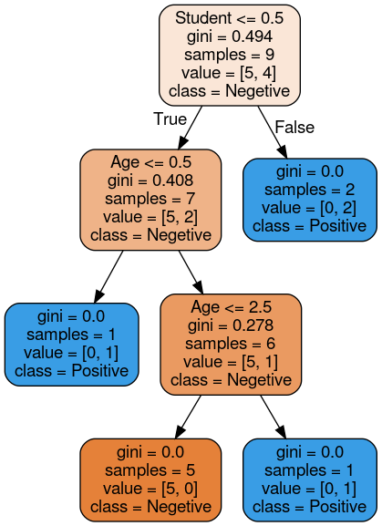

# Decision Tree


```python
import pandas as pd
df = pd.read_csv("Income.csv")
df.head()
```


<div>

<table border="1" class="dataframe">
  <thead>
    <tr style="text-align: right;">
      <th></th>
      <th>Age</th>
      <th>Income</th>
      <th>Student</th>
      <th>Credit</th>
      <th>effect</th>
    </tr>
  </thead>
  <tbody>
    <tr>
      <th>0</th>
      <td>&lt;30</td>
      <td>high</td>
      <td>no</td>
      <td>fair</td>
      <td>negative</td>
    </tr>
    <tr>
      <th>1</th>
      <td>&lt;=30</td>
      <td>high</td>
      <td>no</td>
      <td>excellent</td>
      <td>negative</td>
    </tr>
    <tr>
      <th>2</th>
      <td>31-40</td>
      <td>high</td>
      <td>no</td>
      <td>fair</td>
      <td>positive</td>
    </tr>
    <tr>
      <th>3</th>
      <td>&gt;40</td>
      <td>medium</td>
      <td>no</td>
      <td>fair</td>
      <td>positive</td>
    </tr>
    <tr>
      <th>4</th>
      <td>&lt;=30</td>
      <td>high</td>
      <td>no</td>
      <td>fair</td>
      <td>negative</td>
    </tr>
  </tbody>
</table>
</div>


```python
inputs = df.drop('effect', axis = 'columns')
target = df['effect']
```


```python
inputs.head()
```


<div>

<table border="1" class="dataframe">
  <thead>
    <tr style="text-align: right;">
      <th></th>
      <th>Age</th>
      <th>Income</th>
      <th>Student</th>
      <th>Credit</th>
    </tr>
  </thead>
  <tbody>
    <tr>
      <th>0</th>
      <td>&lt;30</td>
      <td>high</td>
      <td>no</td>
      <td>fair</td>
    </tr>
    <tr>
      <th>1</th>
      <td>&lt;=30</td>
      <td>high</td>
      <td>no</td>
      <td>excellent</td>
    </tr>
    <tr>
      <th>2</th>
      <td>31-40</td>
      <td>high</td>
      <td>no</td>
      <td>fair</td>
    </tr>
    <tr>
      <th>3</th>
      <td>&gt;40</td>
      <td>medium</td>
      <td>no</td>
      <td>fair</td>
    </tr>
    <tr>
      <th>4</th>
      <td>&lt;=30</td>
      <td>high</td>
      <td>no</td>
      <td>fair</td>
    </tr>
  </tbody>
</table>
</div>


## Label string with random value using LabelEncoder


```python
from sklearn.preprocessing import LabelEncoder
```


```python
new_age = LabelEncoder()
new_Income = LabelEncoder()
new_Student = LabelEncoder()
new_Credit = LabelEncoder()
new_d = LabelEncoder()
```


```python
inputs['age_n'] = new_age.fit_transform(inputs['Age'])
inputs['Income_n'] = new_Income.fit_transform(inputs['Income'])
inputs['Student_n'] = new_Student.fit_transform(inputs['Student'])
inputs['Credit_n'] = new_Credit.fit_transform(inputs['Credit'])
target = new_d.fit_transform(target)
inputs.head()
```


<div>

<table border="1" class="dataframe">
  <thead>
    <tr style="text-align: right;">
      <th></th>
      <th>Age</th>
      <th>Income</th>
      <th>Student</th>
      <th>Credit</th>
      <th>age_n</th>
      <th>Income_n</th>
      <th>Student_n</th>
      <th>Credit_n</th>
    </tr>
  </thead>
  <tbody>
    <tr>
      <th>0</th>
      <td>&lt;30</td>
      <td>high</td>
      <td>no</td>
      <td>fair</td>
      <td>1</td>
      <td>0</td>
      <td>0</td>
      <td>1</td>
    </tr>
    <tr>
      <th>1</th>
      <td>&lt;=30</td>
      <td>high</td>
      <td>no</td>
      <td>excellent</td>
      <td>2</td>
      <td>0</td>
      <td>0</td>
      <td>0</td>
    </tr>
    <tr>
      <th>2</th>
      <td>31-40</td>
      <td>high</td>
      <td>no</td>
      <td>fair</td>
      <td>0</td>
      <td>0</td>
      <td>0</td>
      <td>1</td>
    </tr>
    <tr>
      <th>3</th>
      <td>&gt;40</td>
      <td>medium</td>
      <td>no</td>
      <td>fair</td>
      <td>3</td>
      <td>2</td>
      <td>0</td>
      <td>1</td>
    </tr>
    <tr>
      <th>4</th>
      <td>&lt;=30</td>
      <td>high</td>
      <td>no</td>
      <td>fair</td>
      <td>2</td>
      <td>0</td>
      <td>0</td>
      <td>1</td>
    </tr>
  </tbody>
</table>
</div>


```python
inputs_n = inputs.drop(['Age', 'Income', 'Student', 'Credit'], axis = 'columns')
```


```python
inputs_n.head()
```


<div>

<table border="1" class="dataframe">
  <thead>
    <tr style="text-align: right;">
      <th></th>
      <th>age_n</th>
      <th>Income_n</th>
      <th>Student_n</th>
      <th>Credit_n</th>
    </tr>
  </thead>
  <tbody>
    <tr>
      <th>0</th>
      <td>1</td>
      <td>0</td>
      <td>0</td>
      <td>1</td>
    </tr>
    <tr>
      <th>1</th>
      <td>2</td>
      <td>0</td>
      <td>0</td>
      <td>0</td>
    </tr>
    <tr>
      <th>2</th>
      <td>0</td>
      <td>0</td>
      <td>0</td>
      <td>1</td>
    </tr>
    <tr>
      <th>3</th>
      <td>3</td>
      <td>2</td>
      <td>0</td>
      <td>1</td>
    </tr>
    <tr>
      <th>4</th>
      <td>2</td>
      <td>0</td>
      <td>0</td>
      <td>1</td>
    </tr>
  </tbody>
</table>
</div>


```python
from sklearn import tree
```


```python
model = tree.DecisionTreeClassifier()
```


```python
model.fit(inputs_n, target)
```


    DecisionTreeClassifier(ccp_alpha=0.0, class_weight=None, criterion='gini',
                           max_depth=None, max_features=None, max_leaf_nodes=None,
                           min_impurity_decrease=0.0, min_impurity_split=None,
                           min_samples_leaf=1, min_samples_split=2,
                           min_weight_fraction_leaf=0.0, presort='deprecated',
                           random_state=None, splitter='best')


```python
model.score(inputs_n,target)
inputs.head()
```


<div>

<table border="1" class="dataframe">
  <thead>
    <tr style="text-align: right;">
      <th></th>
      <th>Age</th>
      <th>Income</th>
      <th>Student</th>
      <th>Credit</th>
      <th>age_n</th>
      <th>Income_n</th>
      <th>Student_n</th>
      <th>Credit_n</th>
    </tr>
  </thead>
  <tbody>
    <tr>
      <th>0</th>
      <td>&lt;30</td>
      <td>high</td>
      <td>no</td>
      <td>fair</td>
      <td>1</td>
      <td>0</td>
      <td>0</td>
      <td>1</td>
    </tr>
    <tr>
      <th>1</th>
      <td>&lt;=30</td>
      <td>high</td>
      <td>no</td>
      <td>excellent</td>
      <td>2</td>
      <td>0</td>
      <td>0</td>
      <td>0</td>
    </tr>
    <tr>
      <th>2</th>
      <td>31-40</td>
      <td>high</td>
      <td>no</td>
      <td>fair</td>
      <td>0</td>
      <td>0</td>
      <td>0</td>
      <td>1</td>
    </tr>
    <tr>
      <th>3</th>
      <td>&gt;40</td>
      <td>medium</td>
      <td>no</td>
      <td>fair</td>
      <td>3</td>
      <td>2</td>
      <td>0</td>
      <td>1</td>
    </tr>
    <tr>
      <th>4</th>
      <td>&lt;=30</td>
      <td>high</td>
      <td>no</td>
      <td>fair</td>
      <td>2</td>
      <td>0</td>
      <td>0</td>
      <td>1</td>
    </tr>
  </tbody>
</table>
</div>


```python
model.predict([[2,2,0,0]])
```


    array([0])


## Genarating Decision Tree Visualization


```python
from sklearn import metrics,model_selection
from IPython.display import Image, display
import matplotlib.pyplot as plt,pydotplus
```


```python
ddata=tree.export_graphviz(model,out_file=None,filled=True,rounded=True,
                          feature_names=['Age','Income','Student','Credit'],
                          class_names=['Negetive','Positive'])
graph=pydotplus.graph_from_dot_data(ddata)
display(Image(graph.create_png()))
```





```python

```
###
